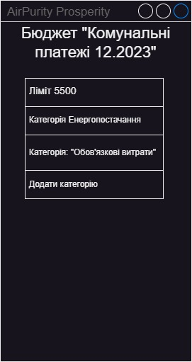

| NFR ID |  Test Case ID  | Опис кроків тестового сценарію | Опис очікуваних результатів |
|----| --------------------------------------- | ----------- | ------------------ |
|NFR1.1| TC1.5 |Початкові умови: відсутні  Кроки сценарію: відсутні  |  |
|NFR1.1| TC1.6 |Початкові умови: успішно пройдено TC1.5  Кроки сценарію:1) В поле Назва категорії внесено Енергопостачання,  2) в поле ліміт категорії внесено 1000   |   |
|NFR1.1| TC1.7 |Початкові умови: успішно пройдено TC1.6  Кроки сценарію:1) натиснути кнопку "додати"|   |